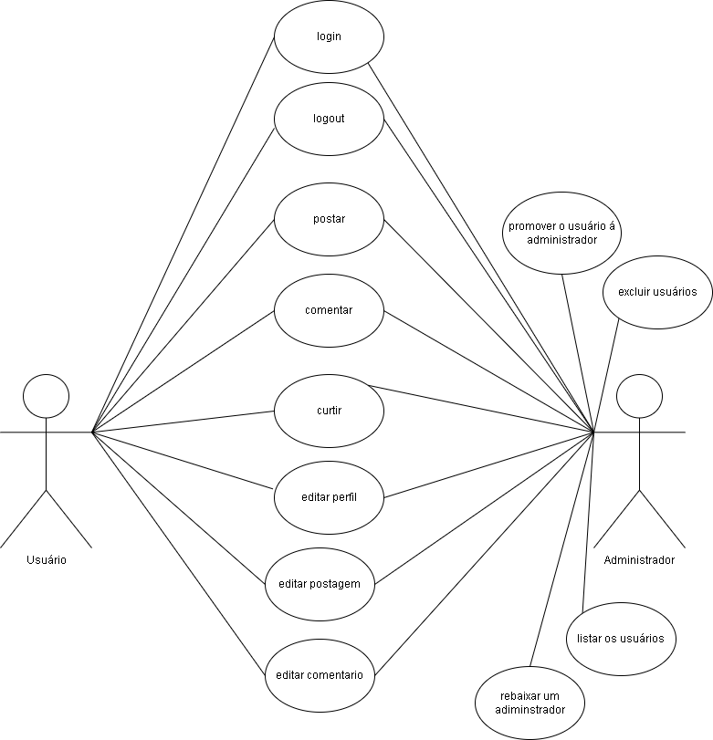
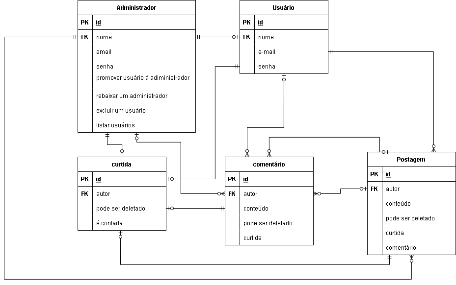

# InstaFood

Projeto Final do Curso Técnico Integrado de Desenvolvimento de Sistemas - Colégio Pedro II - Campus Duque de Caxias

**Integrantes:**
 - Brena Alessandra Simões 

## Contas para logar
**Usuário adm**
- adm@gmail.com Senha: adm2022

 ## Descrição do Projeto

 O tema do meu projeto será voltado para a culinária e vai se chamar Instafood. Foi pensada exclusivamente para usuários que gostem do tipo de conteúdo. Pensei em criar pois é bem díficil encontrar uma rede social que aborde unicamente este assunto.

**Versões utilizadas no projeto**

Apache 2.4.25
PHP 5.6.30
MySQL 5.7.17
PhpMyAdmin 4.7.0

## Documentação

- [Manual do Usuário](manual.md)
- [Requisitos](requisitos.md)
- [Casos de Uso](casos-de-uso.md)
- [Apresentação](apresentaçao.pdf)

**Diagrama de Classes**

**Modelagem do Banco de Dados**

