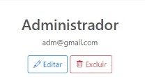

# Manual do Usuário

Nesse documento compilamos o manual de usuário da rede social Instafood, uma rede social criada para a interação de pessoas com interesse na culinária.

**Lista das Funcionalidades:**

 - [Cadastro](#Cadastro)
 - [Login](#Login)
 - [Configurações de Conta](#Configurações-de-Conta)
 - [Post](#Post)
 - [Comentar](#Comentar)
 - [Curtir](#Curtir)
 - [Como se tornar administrador](#Como-se-tornar-um-administrador)
 - [Privilegios do Administrador](#Privilegios-do-Administrador)
 
## Cadastro

Na página de login, no canto superior direito, esta o botão de cadastro, ao  clicar nele é exibido um formulario aonde deve ser inserido o nome, o email, a senha e confirmar essa mesma senha, em seguida clicar no botão cadastrar no final do formulario.

## Login

Na página de login é exibido um formulario com os campos e-mail e senha, ao preencher-los e clicar em login, o usuario será redirecionada para a página de perfil, já para o logout é preciso clicar no botão de menu, localizado no canto superior direito da página, depois clicar em logout.

## Configurações de Conta

No menu de configurações, localizado no canto superior direito da página de perfil, está a opção configuração de conta, ao clicar nessa opção o usuário é redirecionado a outra página aonde se encontra o formulario de alteração do nome de usuário e alteração de senha, para mudar o nome basta escolher um novo nome e preencher ambos os campos com o nome escolhido

para modificar sua senha o usuário deve selecionar a opção mudar senha, em seguida inserir sua senha atual junto com a nova senha e , depois confirmar aquela senha.

## Postar

Para postar no Instafood o usuário deve primeiro inserir uma imagem no formato JPG,JPEG, PNG ou GIF qualquer outro formato não é valido e acarreta uma mensagem de erro caso tente ser postado, nas imagens podem ser inclusas legendas, mas não são obrigatorias.

para realizar a edição de um post o usuário deve clicar no botão de opções presente na parte superior direita da postagem e escolher a opção editar post, o usuario será redirecionado para a aréa de edição, aonde ele poderá alterar a legenda da postagem livremente,já para excluir o post basta escolher a opção excluir post, no botão de opção.

## Curtir

Para curtir uma postagem o usuário deverá clicar no ícone curtir, presente na parte inferior esquerda da postagem

## Comentar

Para comentar o usuário deve digitar no campo presente na parte inferior da postagem e para visualizar o usuário deve clicar no botão comentarios

já para editar um comentario o usuário deve apertar o botão comentarios 

em seguida escolher a opção editar, o sistema então vai redirecionar o usuário para uma área de edição, aonde ele poderá alterar o comentario livremente, já para excluir o post basta escolher a opção excluir no comentario.

## Como se tornar um Administrador

No Instfood para se tornar um administrador é nescessario que um administrador te promova

## Privilegios do Administrador

No instafood o as funções adicionadas obtidas depois de se tornar um administrador são:

![admin]

a listagem de todos os usuário presentes no Instafood naquele momento

e a exclusão de qualquer usuário listado no banco de dados

